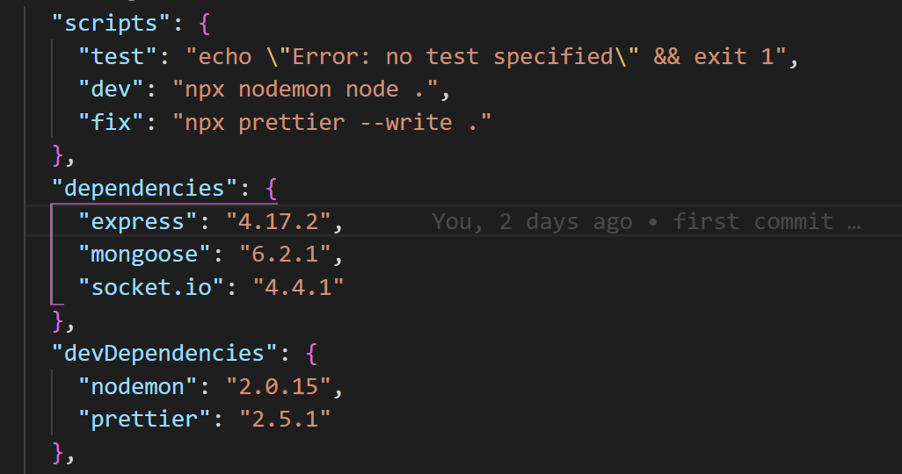

# ToDoList - Socket.io
* List of tasks used in socket-
To-do list using the socket
If you want to make the todo done click on that todo and it will make a line
If you want to delete, double-click

* Activation 
 
 # ScreenShots
 
 
 
