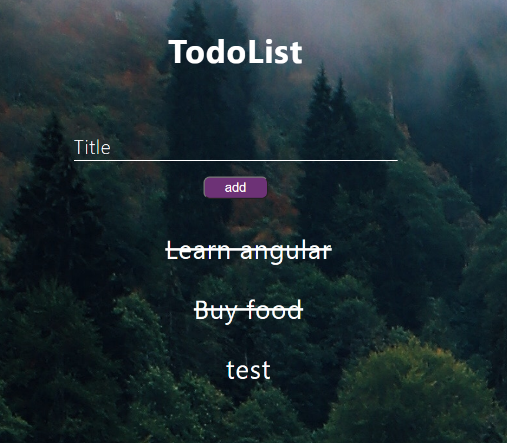
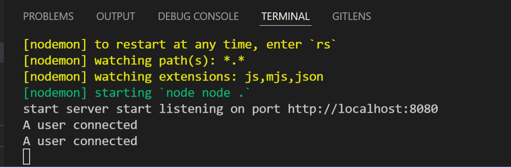
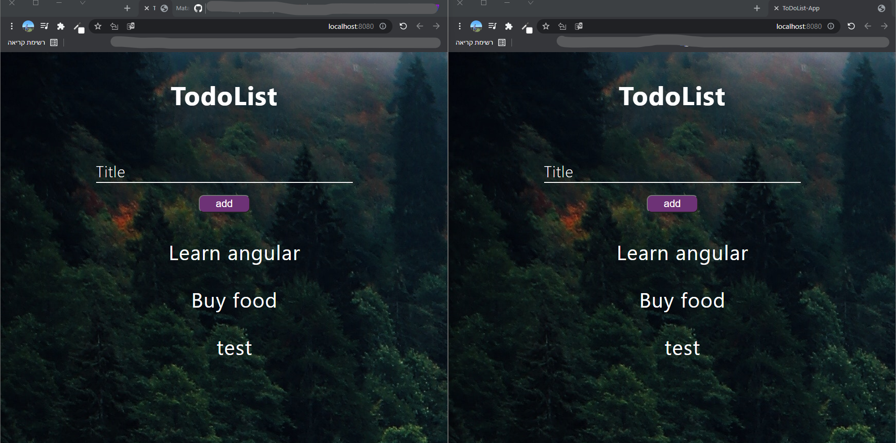

# ToDoList - Socket.io
* List of tasks used in socket-
To-do list using the socket
If you want to make the todo done click on that todo and it will make a line
If you want to delete, double-click

* Activation 
"scripts": {
    "test": "echo \"Error: no test specified\" && exit 1",
    "dev": "npx nodemon node .",
    "fix": "npx prettier --write ."
  },

- "dependencies": {
    "express": "4.17.2",
    "mongoose": "6.2.1",
    "socket.io": "4.4.1"
  },
  "devDependencies": {
    "nodemon": "2.0.15",
    "prettier": "2.5.1"
  },
 # ScreenShots
 
 
 
